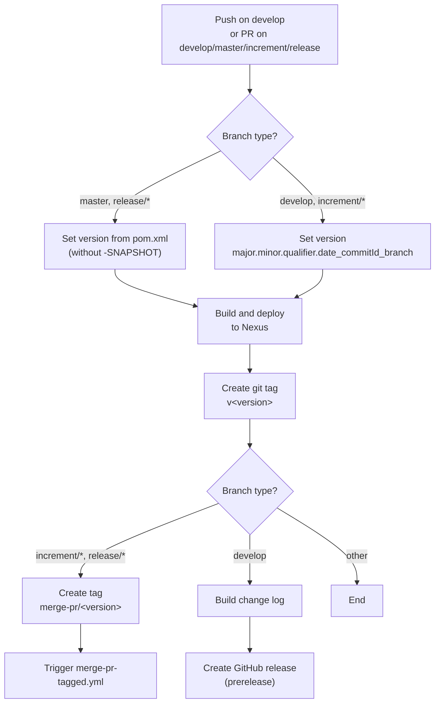
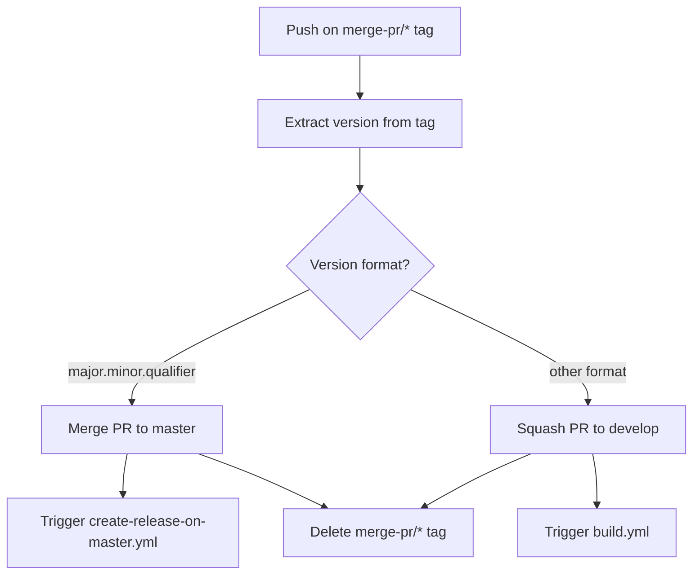
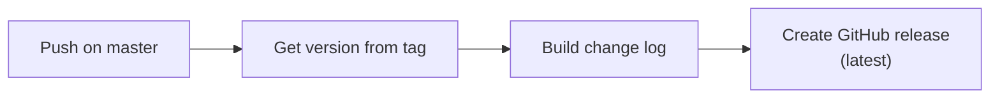
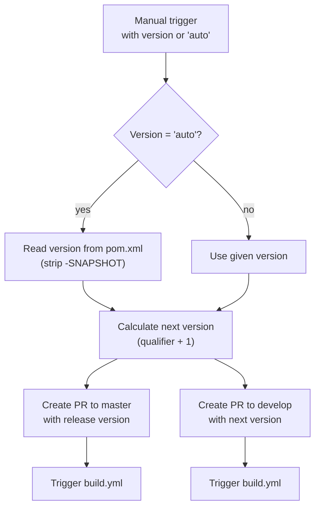

# Development Version and Branch Handling

This document describes the branching strategy, version numbering, and CI/CD pipeline flows used by this project. The workflow is based on [GitFlow](https://www.atlassian.com/git/tutorials/comparing-workflows/gitflow-workflow).

## Branches

The repository uses a structured branching model where each branch type serves a specific purpose in the development lifecycle:

```mermaid
gitDiagram
    commit id: "init"
    branch develop
    checkout develop
    commit id: "dev-1"
    branch feature/JNG-1
    commit id: "feat-1a"
    commit id: "feat-1b"
    checkout develop
    merge feature/JNG-1 id: "merge-feat-1"
    branch feature/JNG-2
    commit id: "feat-2a"
    checkout develop
    merge feature/JNG-2 id: "merge-feat-2"
    branch release/1.0-beta1
    commit id: "rc-1"
    branch bugfix/JNG-3
    commit id: "fix-3"
    checkout release/1.0-beta1
    merge bugfix/JNG-3 id: "merge-fix"
    checkout develop
    merge release/1.0-beta1 id: "back-merge"
    checkout master
    merge release/1.0-beta1 id: "release-1.0"
```

| Branch Pattern | Base | Purpose |
|----------------|------|---------|
| `develop` | — | Main development branch; contains latest development sources of the active version |
| `feature/JNG-NUMBER_short_summary` | `develop` | New features that will be included in the next version |
| `(release/)X.Y.Z` | `develop` | Release stabilization branches (`release/` prefix reserved for CI) |
| `bugfix/JNG-NUMBER_short_summary` | release branch | Bug fixes applied during release testing; must also be applied to develop and newer releases |
| `support/JNG-NUMBER_short_summary` | release branch | Maintenance patches for previously released versions |
| `hotfix/JNG-NUMBER_short_summary` | `master` | Critical fixes applied directly to production; merged to both master and develop |
| `master` | — | Contains the latest released sources |

## Version Numbers

Version numbers follow semantic versioning with these rules:

| Event | Version Change |
|-------|---------------|
| Start a `feature/` branch | No change — inherits from develop |
| Start a `release/` branch | 2nd number on develop is incremented |
| Start a `bugfix/` branch | No change — applied to release during testing |
| Start a `support/` branch | 3rd number is incremented |
| Start a `hotfix/` branch | 4th number is incremented |

## GitHub Actions CI/CD Flows

The project uses several GitHub Actions workflows that trigger each other in a pipeline:

### build.yml — Main Build Pipeline

Triggers on pushes to `develop` and pull requests targeting `develop`, `master`, `increment/*`, or `release/*`.



### merge-pr-tagged.yml — PR Merge Automation

Triggers on push of `merge-pr/*` tags. Determines whether to merge to master or squash to develop based on version format:



### create-release-on-master.yml — Release Publication

Triggers on push to `master`. Creates the final GitHub release with a change log.



### release.yml — Release Initiation

Manually triggered with a version parameter (or `auto` to read from pom.xml):



## Development Rules

> **Important:** There is no commit without a ticket number. Every pull request and commit must reference a `JNG-xxx` JIRA ticket.

Issue tracking is managed via [JIRA](https://blackbelt.atlassian.net/jira/dashboards).
