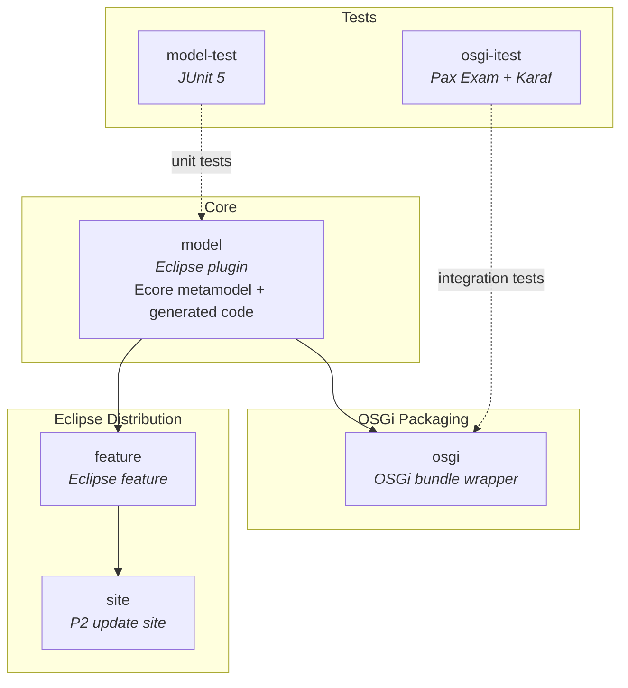
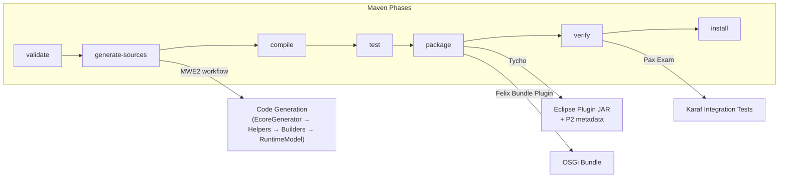

# Contributing to JUDO

## Prerequisites

Make sure your development environment has:

- **Java 21** JDK
- **Maven 3.9.4+** (or use the included `mvnw` wrapper)
- For Eclipse plugin development: Eclipse IDE with m2e, Epsilon, and Modeling Tools plugins

For full environment setup details, see the parent project's [CONTRIBUTING guide](https://github.com/BlackBeltTechnology/judo-community/blob/develop/CONTRIBUTING.adoc).

## Code Structure

This project is a Maven multi-module build that uses **Tycho** to bridge Maven and Eclipse plugin packaging. Modules are organized in layers: the core metamodel at the bottom, test modules alongside, and packaging/distribution modules on top.



### Eclipse-related modules

| Module | Purpose |
|--------|---------|
| `feature/` | Eclipse feature definition — allows installation as an Eclipse plugin feature |
| `site/` | Eclipse Update Site — all built versions are compiled as a P2 repository. The site definition contains required referenced repositories. |

The JUDO update sites are version-based, so version numbers are encoded in URLs. Since Tycho loads the category definition as an extension (before version substitution is possible), a dedicated profile handles version replacement:

```bash
mvn clean install -P update-category-versions -f site/pom.xml
```

### Model modules

| Module | Purpose |
|--------|---------|
| `model/` | Eclipse plugin containing the Ecore metamodel and EMF-generated Java classes. Builder and Helper classes are added via MWE2 workflow. |
| `model-test/` | Unit tests for model creation, ID validation, and Epsilon constraint execution |

### OSGi wrapper modules

| Module | Purpose |
|--------|---------|
| `osgi/` | OSGi bundle that repackages the model with extra metadata and services (including `MeasureModelBundleTracker` for auto-discovery), enabling use in Karaf transformation pipelines |
| `osgi-itest/` | Integration tests using Pax Exam to verify bundle loading in a Karaf container |

## Build Lifecycle

The build pipeline uses Tycho to combine Maven phases with Eclipse plugin tooling:



## Working with Eclipse

### Plugin requirements

- m2e
- Epsilon
- Modeling Tools

### Installation

Install the plugin via P2 sites: go to "Install new software" and add the URL of the site listed on GitHub, or point to the uncompressed ZIP folder. The plugin contains the metamodel and the default UI editor.

### Code generation in Eclipse

Required features:

- XTend
- XText
- MWE / MWE2

There are predefined launchers for regenerating the language model and helpers. Execute in Eclipse:

```
Generate JSL.launch
```

Alternatively, run as MWE2 Workflow:

```
hu.blackbelt.judo.meta.measure.model project src/workflow/generateModel.mwe2
```

## Troubleshooting

### Running JUnit tests in Eclipse

There is a known issue with Eclipse and Tycho where the classpath does not contain JUnit. The workaround is a `Required-Bundle` entry in the OSGi Manifest (not Tycho-recommended):

```xml
<classpathentry kind="con" path="org.eclipse.jdt.junit.JUNIT_CONTAINER/5"/>
```

See [Eclipse Bug 534587](https://bugs.eclipse.org/bugs/show_bug.cgi?id=534587) for details.

### Problems with Lombok

Tycho does not support Lombok generation directly ([lombok#285](https://github.com/rzwitserloot/lombok/issues/285)). No Lombok is used in the Eclipse plugin modules — all source code there is generated.

### Problems with Tycho

Tycho 1.4.0 and below does not handle repository references inside site definitions. All referenced plugin sites must be added manually. See [Eclipse Bug 453708](https://bugs.eclipse.org/bugs/show_bug.cgi?id=453708).

## Version Policy

Maven and Eclipse have different version conventions:

| Convention | Example |
|------------|---------|
| Maven SNAPSHOT | `1.0.0-SNAPSHOT` |
| Eclipse qualifier | `1.0.0.qualifier` |

These are equivalent. The **Tycho Versions Plugin** replaces the qualifier with a technical version number (timestamp + commit hash) during every build. The `flatten-maven-plugin` resolves CI-friendly `${revision}` properties.

## Submission Guidelines

### Submitting an Issue

Before submitting, search the [issue tracker](https://github.com/BlackBeltTechnology/judo-meta-measure/issues) — your issue may already be resolved.

To help us reproduce the problem, include:

- Output of `java -version` and `mvn -version`
- `pom.xml` or `.flattened-pom.xml` (when applicable)
- A minimal use-case that fails

### Submitting a PR

This project follows [GitHub's standard forking model](https://guides.github.com/activities/forking/). Fork the project and submit pull requests from your fork.

## Commands

### Run Tests

```bash
mvn clean test
```

### Run Full Build

```bash
mvn clean install
```
