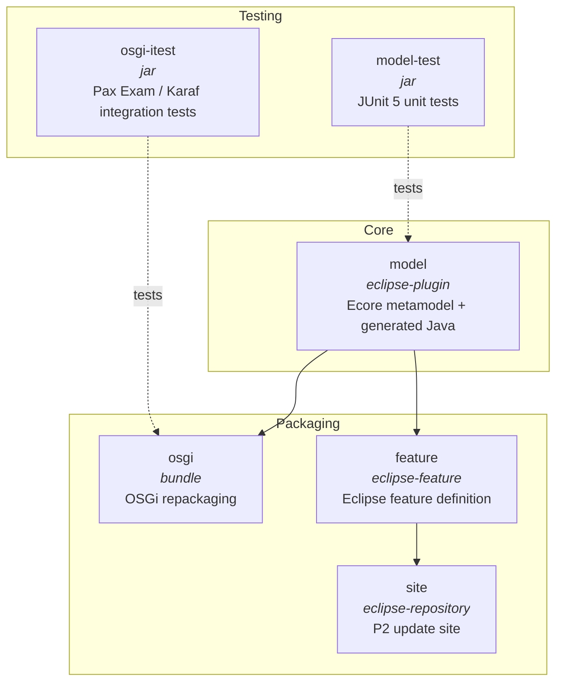
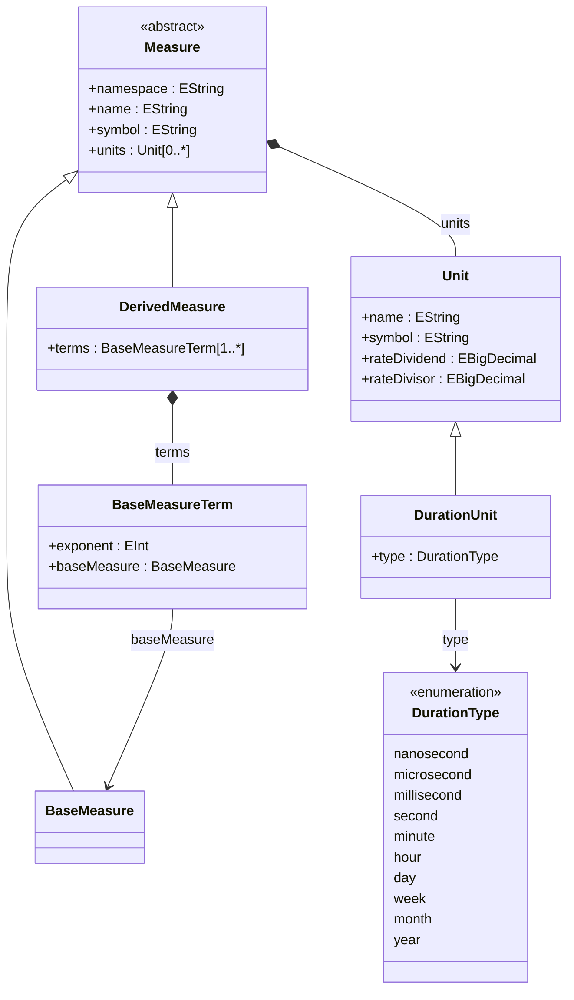

# judo-meta-measure

[](https://github.com/BlackBeltTechnology/judo-meta-measure/actions/workflows/build.yml)

## Introduction

judo-meta-measure is an EMF/Ecore metamodel that implements the [SI (International System of Units)](https://en.wikipedia.org/wiki/International_System_of_Units) standard, extended with descriptions for measuring physical quantities. It provides a type-safe, model-driven representation of base measures (length, mass, time, etc.), derived measures (speed, force, etc.), and their associated units with conversion rates.

The project produces artifacts in three forms:

- **Eclipse Plugin** with full editor support via P2 update sites
- **OSGi Bundle** for Karaf and other non-Eclipse OSGi containers
- **Maven Artifact** for standalone JVM use in transformation pipelines

## Context

This project is a building block of the [judo-community](https://github.com/BlackBeltTechnology/judo-community) aggregator project. It is consumed by other JUDO modules that need to reason about units of measurement in model transformations and code generation.

## Module Overview

The project is organized as a multi-module Maven/Tycho build with six modules that span from the core metamodel down to deployment artifacts:



| Module | Packaging | Description |
|--------|-----------|-------------|
| `model/` | eclipse-plugin | Core Ecore metamodel (`measure.ecore`), MWE2 code generation, Epsilon validation scripts, and hand-written utilities (`MeasureUtils`, `MeasureEpsilonValidator`) |
| `model-test/` | jar | Unit tests for model creation, XMI ID validation, and Epsilon constraint execution |
| `osgi/` | bundle | Repackages the model as a standard OSGi bundle with `MeasureModelBundleTracker` for auto-discovery |
| `osgi-itest/` | jar | Integration tests that deploy the bundle into a Karaf container and verify model loading |
| `feature/` | eclipse-feature | Eclipse feature descriptor for plugin installation |
| `site/` | eclipse-repository | P2 update site for Eclipse marketplace distribution |

## Metamodel

The Ecore metamodel (`model/model/measure.ecore`, namespace URI `http://blackbelt.hu/judo/meta/measure`) defines these core types:



- **BaseMeasure** represents fundamental SI quantities (length, mass, time, etc.)
- **DerivedMeasure** composes base measures with exponents (e.g., speed = length^1 * time^-1)
- **Unit** holds conversion rates via `rateDividend` / `rateDivisor` relative to the measure's base unit
- **DurationUnit** is a specialized unit with a `DurationType` enum covering nanosecond through year

## Quick Start

```bash
# Full build (includes tests)
mvn clean install

# Build without tests
mvn clean install -DskipTests

# Run unit tests only
mvn clean test

# Run a single test class
mvn -pl model-test -Dtest=MeasureValidationTest clean test
```

> **Note:** Requires Java 21 and Maven 3.9.4+. A Maven wrapper (`mvnw`) is available.

## Contributing

See [CONTRIBUTING.md](CONTRIBUTING.md) for development setup, code structure details, and submission guidelines.

## License

This project is licensed under the [Eclipse Public License - v 2.0](https://www.eclipse.org/legal/epl-2.0/).
